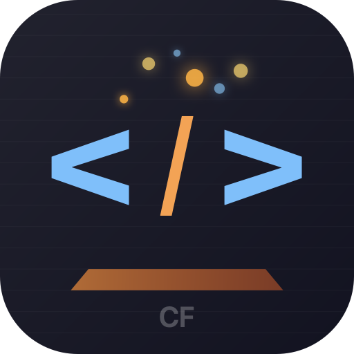

<p align="center">
  
</p>

<h1 align="center">CodeForge</h1>

<p align="center">
  <strong>A native macOS code editor with on-device AI — no cloud, no servers, no telemetry.</strong>
</p>

<p align="center">
  
  
  
  
  
  
</p>

<br>

> **Your code never leaves your Mac.** CodeForge runs a 7B-parameter language model directly on Apple Silicon GPU via MLX. No API keys. No subscriptions. No internet required after first model download.

---

## What Makes CodeForge Different

Every popular code editor with AI sends your code to the cloud. CodeForge doesn't.

| | CodeForge | VS Code + Copilot | Cursor | Zed |
|---|:---:|:---:|:---:|:---:|
| **AI runs on-device** | Yes (MLX) | No (cloud API) | No (cloud API) | No (cloud API) |
| **Zero cloud dependency** | Yes | No | No | Partial |
| **Your code stays local** | Always | Never with AI | Never with AI | Depends |
| **Works offline** | Yes* | No AI offline | No AI offline | No AI offline |
| **Native macOS app** | Yes (SwiftUI) | Electron | Electron | Rust + GPUI |
| **Memory (no model)** | <200MB | ~800MB | ~1GB | ~300MB |
| **Cold launch** | <100ms | 2-4s | 2-4s | ~500ms |
| **No subscription** | Free | $10/mo | $20/mo | Free (no AI) |
| **No telemetry** | Zero | Opt-out | Opt-out | Opt-out |
| **Encrypted conversations** | AES-256-GCM | No | No | N/A |

<sub>* After initial ~4GB model download</sub>

### The Core Philosophy

1. **Privacy is not a setting — it's the architecture.** There is no server. There is no network call. The AI model runs as a Metal compute shader on your GPU.

2. **Native means native.** Not Electron wrapped in a macOS skin. Real NSTextView (TextKit 1), real NSRulerView line numbers, real forkpty() terminal, real Metal shaders. 60MB total, not 600MB.

3. **Your conversations are encrypted at rest.** AI chat history is AES-256-GCM encrypted with a key stored in the macOS Keychain. Even if someone copies your SQLite database, they can't read your conversations without your Mac's Keychain.

---

## Features

### Code Editor
- **TreeSitter syntax highlighting** for Swift and Python with incremental re-parsing
- **NSTextView** bridge (TextKit 1) — responsive, native text rendering
- **Line number gutter** with active line tracking
- **Undo/Redo** with coalesced edit grouping
- **Autosave** every 5 seconds with crash recovery
- **File validation** — UTF-8, <50K lines, no symlinks

### AI Assistant (100% Local)
- **7B parameter model** (Qwen2.5-Coder-7B-Instruct-4bit) via MLX
- **Explain** — select code, get a plain-English explanation
- **Suggest Edit** — describe what you want changed, get inline diffs with Accept/Reject
- **Ask anything** — free-form questions with full file context
- **Streaming output** — see tokens appear in real-time
- **Context-aware** — sliding window truncation centered on your cursor position
- **Prompt injection prevention** — user content is sanitized before reaching the model

### Integrated Terminal
- **Real pseudoterminal** via `forkpty()` — not a shell wrapper
- **256-color ANSI** support with full SGR parsing
- **10,000-line scrollback** buffer
- Inherits your shell (zsh/bash/fish), PATH, and environment
- Resize with `TIOCSWINSZ` + `SIGWINCH`

### Architecture
- **4 isolated actors** — ParsingActor, InferenceActor, TerminalActor, MainActor (UI)
- **Swift 6 strict concurrency** — zero data races, compile-time verified
- **SwiftData** persistence with versioned schema migration
- **AsyncStream** for all inter-actor communication
- **Metal shaders** precompiled at build time for gutter glow and selection effects

---

## Quick Start

### Requirements
- macOS 15 Sequoia or later
- Apple Silicon Mac (M1/M2/M3/M4)
- Xcode 16+ (to build from source)
- ~4GB free disk space (for AI model, downloaded once)

### Build & Run

```bash
git clone https://github.com/salvadalba/nodaysidle-codeforge.git
cd nodaysidle-codeforge/CodeForge
open CodeForge.xcodeproj
```

Press `Cmd+R` in Xcode. That's it.

### Or from the command line:

```bash
xcodebuild build -scheme CodeForge -destination 'platform=macOS,arch=arm64' -configuration Release
```

The built `.app` will be in `DerivedData/.../Build/Products/Release/CodeForge.app`.

---

## Keyboard Shortcuts

| Action | Shortcut |
|---|---|
| Open File | `Cmd+O` |
| Save File | `Cmd+S` |
| Undo | `Cmd+Z` |
| Redo | `Cmd+Shift+Z` |
| Toggle AI Panel | `Cmd+Shift+A` |
| Toggle Terminal | `Cmd+Shift+T` |
| Explain Selection | `Cmd+Shift+E` |
| Ask Question | `Cmd+Shift+Q` |

All shortcuts are customizable in Settings (`Cmd+,`).

---

## Project Structure

```
CodeForge/
├── App/CodeForgeApp.swift              # Entry point, menu bar, Settings scene
├── Actors/
│   ├── ParsingActor.swift              # TreeSitter parse + highlight
│   ├── InferenceActor.swift            # MLX model lifecycle + generation
│   └── TerminalActor.swift             # forkpty shell management
├── Models/
│   ├── SchemaV1.swift                  # SwiftData models + migration
│   ├── AIMessage.swift                 # Codable chat message
│   ├── EditorModel.swift               # Editor state (@Observable)
│   ├── AIAgentModel.swift              # AI panel state
│   ├── TerminalModel.swift             # Terminal state + rendering
│   ├── VirtualScreenBuffer.swift       # Cell grid with scrollback
│   ├── EditSuggestion.swift            # AI edit proposal parser
│   ├── HighlightRange.swift            # Syntax highlight token
│   └── TokenType.swift                 # Token classification
├── Services/
│   ├── PersistenceService.swift        # SwiftData CRUD + LRU eviction
│   ├── EncryptionService.swift         # AES-256-GCM + Keychain key
│   ├── KeychainHelper.swift            # macOS Keychain wrapper
│   ├── EditorService.swift             # File I/O + validation
│   ├── PromptBuilder.swift             # Prompt construction + truncation
│   ├── ModelDownloader.swift           # HuggingFace model management
│   ├── ANSIParser.swift                # ANSI escape sequence parser
│   └── KeyBindingService.swift         # Shortcut configuration
├── Views/
│   ├── ContentView.swift               # Three-panel layout
│   ├── EditorView.swift                # NSTextView bridge
│   ├── LineNumberGutter.swift          # NSRulerView line numbers
│   ├── AIAgentView.swift               # Chat sidebar
│   ├── EditSuggestionOverlay.swift     # Inline diff overlay
│   ├── TerminalView.swift              # Terminal emulator view
│   └── SettingsView.swift              # Preferences UI
├── Shaders/
│   ├── GutterGlow.metal                # Active line glow effect
│   └── SelectionEffect.metal           # Selection highlight effect
└── Resources/
    ├── highlights-swift.scm            # TreeSitter Swift queries
    └── highlights-python.scm           # TreeSitter Python queries
```

---

## Tests

118 unit tests covering all layers:

```bash
xcodebuild test -scheme CodeForge -destination 'platform=macOS,arch=arm64'
```

| Suite | Tests | Coverage |
|---|---|---|
| EncryptionTests | 9 | Roundtrip, tamper detection, IV uniqueness, cross-key isolation |
| PersistenceTests | 12 | CRUD, LRU eviction, encrypted conversation, upsert |
| EditorTests | 24 | EditorModel, SourceLanguage, TokenType, EditorService, ParsingActor |
| TerminalTests | 30 | VirtualScreenBuffer, ANSIParser, TerminalActor, TermColor |
| AIAgentTests | 27 | EditSuggestion parsing, PromptBuilder, AIAgentModel, AIMessage |
| AppShellTests | 16 | KeyBindingService, Notification names, ModelDownloader |

---

## Data & Privacy

| What | Where | Encrypted |
|---|---|---|
| Preferences | `~/Library/Application Support/CodeForge/CodeForge.sqlite` | No (non-sensitive) |
| Recent files | Same SQLite | No (paths only) |
| AI conversations | Same SQLite | **AES-256-GCM** |
| Encryption key | macOS Keychain | Hardware-protected |
| AI model | `~/Library/Application Support/CodeForge/Models/` | N/A (public weights) |

**No data is ever transmitted over the network** except the one-time model download from Hugging Face.

---

## Tech Stack

| Component | Technology |
|---|---|
| Language | Swift 6 (strict concurrency) |
| UI | SwiftUI 6 + NSViewRepresentable bridges |
| Editor | NSTextView (TextKit 1) |
| Syntax | TreeSitter via swift-tree-sitter |
| AI | MLX via mlx-swift-lm |
| Persistence | SwiftData (SQLite) |
| Encryption | CryptoKit AES-256-GCM |
| Terminal | forkpty() + ANSI parser |
| Shaders | Metal (precompiled) |
| State | Observation framework (@Observable) |

---

## Contributing

Pull requests welcome. Please follow the conventions in `CLAUDE.md` — especially:
- Swift 6 strict concurrency in all files
- Observation framework only (no Combine, no ObservableObject)
- OSLog with subsystem `com.codeforge.app`
- Unit tests for every service and actor

---

## License

MIT

---

<p align="center">
  <sub>Built with care on Apple Silicon. No clouds were harmed in the making of this editor.</sub>
</p>
